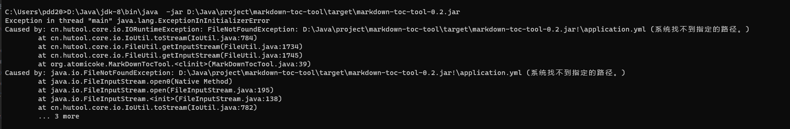

# Java markdown toc tool

根据markdown生成对应的目录

prev:

```
# ..后端整合框架
## 1.spring cloud gateway
### a.关于spring cloud gateway 自动路由
### b.关于使用lb://server-name 语法遇到的问题
### c.网关拦截测试
### d.关于open feign 在某些情况下 get请求会变成post请求
### e.调用一次open feign接口后，获取不到原来的http request 请求
## 2.使用dubbo 作为rpc框架
## 3.集成sentinel

```

after:

```
* [..后端整合框架](#%E5%90%8E%E7%AB%AF%E6%95%B4%E5%90%88%E6%A1%86%E6%9E%B6)
    * [1.spring cloud gateway](#1spring-cloud-gateway)
        * [a.关于spring cloud gateway 自动路由](#a%E5%85%B3%E4%BA%8Espring-cloud-gateway-%E8%87%AA%E5%8A%A8%E8%B7%AF%E7%94%B1)
        * [b.关于使用lb://server-name 语法遇到的问题](#b%E5%85%B3%E4%BA%8E%E4%BD%BF%E7%94%A8lbserver-name-%E8%AF%AD%E6%B3%95%E9%81%87%E5%88%B0%E7%9A%84%E9%97%AE%E9%A2%98)
        * [c.网关拦截测试](#c%E7%BD%91%E5%85%B3%E6%8B%A6%E6%88%AA%E6%B5%8B%E8%AF%95)
        * [d.关于open feign 在某些情况下 get请求会变成post请求](#d%E5%85%B3%E4%BA%8Eopen-feign-%E5%9C%A8%E6%9F%90%E4%BA%9B%E6%83%85%E5%86%B5%E4%B8%8B-get%E8%AF%B7%E6%B1%82%E4%BC%9A%E5%8F%98%E6%88%90post%E8%AF%B7%E6%B1%82)
        * [e.调用一次open feign接口后，获取不到原来的http request 请求](#e%E8%B0%83%E7%94%A8%E4%B8%80%E6%AC%A1open-feign%E6%8E%A5%E5%8F%A3%E5%90%8E%E8%8E%B7%E5%8F%96%E4%B8%8D%E5%88%B0%E5%8E%9F%E6%9D%A5%E7%9A%84http-request-%E8%AF%B7%E6%B1%82)
    * [2.使用dubbo 作为rpc框架](#2%E4%BD%BF%E7%94%A8dubbo-%E4%BD%9C%E4%B8%BArpc%E6%A1%86%E6%9E%B6)
    * [3.集成sentinel](#3%E9%9B%86%E6%88%90sentinel)
```

## Set up

- jdk 1.8
- 源码下载：git clone git@github.com:likedeke/java-markdown-toc-tool.git
- 下载编译好的Jar包[go to releases页面](https://github.com/likedeke/java-markdown-toc-tool/releases)

## Usage

```bash
java -jar xxx.jar       # 查看帮助
java -jar xxx.jar -rf <with remoteFileUrl>
java -jar xxx.jar -lf <with localFilePath>
``` 


## Help

查看有多少种命令[go to 源码](https://github.com/likedeke/java-markdown-toc-tool/blob/like/src/main/java/org/atomicoke/mdtoc/MdTocToolCliArg.java)

## Dependence

- hutool [5.7.6]
- jcommander [1.81]
- snakeyaml [1.10]
- lombok [1.18.20]
- junit [5.7.2]

## Version

- v-0.2.2
    - fix:在jar包环境中找不到handler的实现类
- v-0.2.1
    - fix:在jar包环境中找不到src\resources\application.yml
      
- v-0.2
    - 基于jcommander对项目进行命令行的改造
    - 修复标题行打印不全（原因：\r导致）
- v-0.01
    - 第一次提交
    - 简单测试功能

## TODO List

- [ ] 解析代码块，代码块里的内容还会存在，导致不准确
- [x] 在jar包环境中找不到src\resources\application.yml
    - 使用ClassPathResource
- [x] 在jar包环境中找不到handler的实现类
    - 解决方案:添加配置信息，使用MdTocToolProperties#handlerClassNames来配置全限定类名，然后使用类加载器进行加载。

